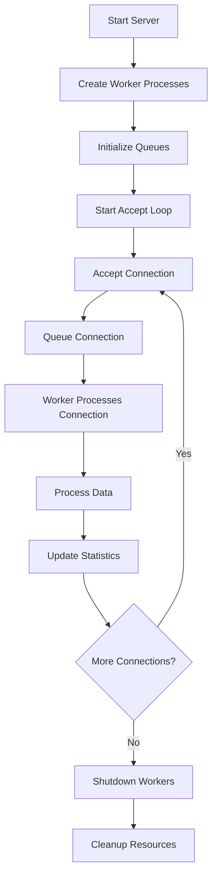

# Multiprocessing Server Implementation Guide

## Table of Contents
1. [Multiprocessing Architecture](#multiprocessing-architecture)
2. [Process Communication](#process-communication)
3. [Load Balancing Strategies](#load-balancing-strategies)
4. [Memory Management](#memory-management)
5. [Error Handling and Recovery](#error-handling-and-recovery)
6. [Performance Optimization](#performance-optimization)
7. [Integration Patterns](#integration-patterns)
8. [Production Deployment](#production-deployment)
9. [Testing and Validation](#testing-and-validation)

## Multiprocessing Architecture

### 1. Master-Worker Pattern

The server implements a **Master-Worker** multiprocessing pattern where:

- **Master Process**: Manages connections, distributes work, monitors workers
- **Worker Processes**: Handle client connections and data processing
- **Communication**: Uses queues for inter-process communication

```python
class MultiprocessingServer:
    def __init__(self, host, port, num_workers=4, max_clients=10):
        self.host = host
        self.port = port
        self.num_workers = num_workers
        self.max_clients = max_clients
        
        # Inter-process communication
        self.connection_queue = multiprocessing.Queue()
        self.stats_queue = multiprocessing.Queue()
        
        # Worker management
        self.workers = []
        self.running = False
        self.stats = ServerStats()
```

### 2. Process Lifecycle



### 3. Worker Process Implementation

```python
def worker_process(worker_id, connection_queue, stats_queue):
    """Worker process for handling client connections"""
    
    # Set process priority for better performance
    try:
        current_process = psutil.Process()
        current_process.nice(psutil.HIGH_PRIORITY_CLASS)
        print(f"Worker {worker_id}: Set high process priority")
    except Exception as e:
        print(f"Worker {worker_id}: Could not set process priority: {e}")
    
    # Set CPU affinity
    try:
        os.sched_setaffinity(0, [worker_id % multiprocessing.cpu_count()])
    except Exception as e:
        print(f"Worker {worker_id}: Could not set CPU affinity: {e}")
    
    # Process connections from queue
    while True:
        try:
            # Get connection from queue (blocking with timeout)
            client_socket, client_address = connection_queue.get(timeout=1)
            
            # Handle client connection
            handle_client(client_socket, client_address, worker_id, stats_queue)
            
        except queue.Empty:
            # No connection available, continue
            continue
        except Exception as e:
            logger.error(f"Worker {worker_id} error: {e}")
            # Send error statistics
            stats_queue.put({
                'worker_id': worker_id,
                'type': 'error',
                'error': str(e),
                'timestamp': time.time()
            })
```

## Process Communication

### 1. Queue-Based Communication

The system uses Python's `multiprocessing.Queue` for inter-process communication:

```python
# Connection distribution
def distribute_connection(self, client_socket, client_address):
    """Distribute connection to available worker"""
    try:
        self.connection_queue.put((client_socket, client_address), timeout=1)
        logger.info(f"Connection from {client_address} queued for processing")
    except queue.Full:
        logger.error("Connection queue full, rejecting connection")
        client_socket.close()
        return False
    return True

# Statistics collection
def collect_statistics(self):
    """Collect statistics from workers"""
    while not self.stats_queue.empty():
        try:
            stats = self.stats_queue.get_nowait()
            self.process_worker_stats(stats)
        except queue.Empty:
            break
```

### 2. Statistics Aggregation

```python
def process_worker_stats(self, stats):
    """Process statistics from workers"""
    worker_id = stats.get('worker_id')
    stats_type = stats.get('type')
    
    if stats_type == 'packet_processed':
        # Update packet statistics
        self.stats.total_packets += stats.get('packets', 0)
        self.stats.total_bytes += stats.get('bytes', 0)
        
    elif stats_type == 'connection_established':
        # Update connection statistics
        self.stats.active_connections += 1
        self.stats.total_connections += 1
        
    elif stats_type == 'connection_closed':
        # Update connection statistics
        self.stats.active_connections -= 1
        
    elif stats_type == 'error':
        # Update error statistics
        self.stats.errors += 1
        logger.error(f"Worker {worker_id} error: {stats.get('error')}")
```

### 3. Memory-Efficient Communication

```python
# Use shared memory for large data structures
import multiprocessing as mp

class SharedStats:
    def __init__(self):
        # Use shared memory for statistics
        self.total_packets = mp.Value('i', 0)
        self.total_bytes = mp.Value('i', 0)
        self.active_connections = mp.Value('i', 0)
        self.errors = mp.Value('i', 0)
        
        # Use locks for thread-safe access
        self.lock = mp.Lock()
    
    def update_packets(self, packets, bytes_sent):
        with self.lock:
            self.total_packets.value += packets
            self.total_bytes.value += bytes_sent
    
    def get_stats(self):
        with self.lock:
            return {
                'total_packets': self.total_packets.value,
                'total_bytes': self.total_bytes.value,
                'active_connections': self.active_connections.value,
                'errors': self.errors.value
            }
```

## Load Balancing Strategies

### 1. Round-Robin Distribution

```python
def distribute_connections_round_robin(self, client_socket, client_address):
    """Distribute connections using round-robin"""
    worker_id = self.next_worker_id % self.num_workers
    self.next_worker_id += 1
    
    # Send to specific worker queue
    worker_queue = self.worker_queues[worker_id]
    try:
        worker_queue.put((client_socket, client_address), timeout=1)
        logger.info(f"Connection from {client_address} assigned to worker {worker_id}")
    except queue.Full:
        logger.error(f"Worker {worker_id} queue full, rejecting connection")
        client_socket.close()
```

### 2. Load-Based Distribution

```python
def distribute_connections_by_load(self, client_socket, client_address):
    """Distribute connections based on worker load"""
    # Find worker with least connections
    min_connections = float('inf')
    selected_worker = 0
    
    for worker_id, worker_stats in self.worker_loads.items():
        if worker_stats['active_connections'] < min_connections:
            min_connections = worker_stats['active_connections']
            selected_worker = worker_id
    
    # Send to selected worker
    worker_queue = self.worker_queues[selected_worker]
    try:
        worker_queue.put((client_socket, client_address), timeout=1)
        self.worker_loads[selected_worker]['active_connections'] += 1
    except queue.Full:
        logger.error(f"Worker {selected_worker} queue full, rejecting connection")
        client_socket.close()
```

### 3. Dynamic Load Balancing

```python
class DynamicLoadBalancer:
    def __init__(self, num_workers):
        self.num_workers = num_workers
        self.worker_metrics = {}
        self.load_threshold = 0.8  # 80% capacity threshold
        
    def select_worker(self, client_socket, client_address):
        """Select worker based on current load and performance"""
        
        # Calculate worker scores
        worker_scores = {}
        for worker_id in range(self.num_workers):
            metrics = self.worker_metrics.get(worker_id, {})
            
            # Calculate load factor
            active_connections = metrics.get('active_connections', 0)
            max_connections = metrics.get('max_connections', 10)
            load_factor = active_connections / max_connections
            
            # Calculate performance factor
            error_rate = metrics.get('error_rate', 0)
            performance_factor = 1.0 - error_rate
            
            # Combined score
            worker_scores[worker_id] = performance_factor * (1.0 - load_factor)
        
        # Select worker with highest score
        selected_worker = max(worker_scores, key=worker_scores.get)
        
        # Check if worker is overloaded
        if worker_scores[selected_worker] < 0.2:
            logger.warning(f"All workers overloaded, selected worker {selected_worker}")
        
        return selected_worker
```

## Memory Management

### 1. Process Memory Isolation

```python
def setup_worker_memory(worker_id):
    """Setup memory management for worker process"""
    
    # Set memory limits
    import resource
    try:
        # Set memory limit (e.g., 1GB per worker)
        memory_limit = 1024 * 1024 * 1024  # 1GB
        resource.setrlimit(resource.RLIMIT_AS, (memory_limit, memory_limit))
    except Exception as e:
        logger.warning(f"Could not set memory limit: {e}")
    
    # Enable garbage collection
    import gc
    gc.set_threshold(100, 10, 10)  # More aggressive GC
    
    # Monitor memory usage
    def monitor_memory():
        process = psutil.Process()
        memory_info = process.memory_info()
        if memory_info.rss > memory_limit * 0.9:  # 90% of limit
            logger.warning(f"Worker {worker_id} approaching memory limit")
            gc.collect()  # Force garbage collection
    
    return monitor_memory
```

### 2. Shared Memory Optimization

```python
import multiprocessing as mp
from multiprocessing import shared_memory

class OptimizedSharedStats:
    def __init__(self):
        # Use shared memory for large data structures
        self.shm = shared_memory.SharedMemory(create=True, size=1024)
        self.stats_array = np.ndarray((256,), dtype=np.int64, buffer=self.shm.buf)
        
        # Initialize statistics
        self.stats_array[0] = 0  # total_packets
        self.stats_array[1] = 0  # total_bytes
        self.stats_array[2] = 0  # active_connections
        self.stats_array[3] = 0  # errors
    
    def update_packets(self, packets, bytes_sent):
        """Atomically update packet statistics"""
        self.stats_array[0] += packets
        self.stats_array[1] += bytes_sent
    
    def cleanup(self):
        """Cleanup shared memory"""
        self.shm.close()
        self.shm.unlink()
```

### 3. Memory Pool Management

```python
class MemoryPool:
    def __init__(self, pool_size=1000, buffer_size=4096):
        self.pool_size = pool_size
        self.buffer_size = buffer_size
        self.available_buffers = mp.Queue()
        self.used_buffers = set()
        
        # Pre-allocate buffers
        for _ in range(pool_size):
            buffer = bytearray(buffer_size)
            self.available_buffers.put(buffer)
    
    def get_buffer(self):
        """Get buffer from pool"""
        try:
            buffer = self.available_buffers.get(timeout=0.1)
            self.used_buffers.add(id(buffer))
            return buffer
        except queue.Empty:
            # Pool exhausted, allocate new buffer
            return bytearray(self.buffer_size)
    
    def return_buffer(self, buffer):
        """Return buffer to pool"""
        buffer_id = id(buffer)
        if buffer_id in self.used_buffers:
            self.used_buffers.remove(buffer_id)
            buffer.clear()  # Clear buffer contents
            self.available_buffers.put(buffer)
```

## Error Handling and Recovery

### 1. Worker Process Recovery

```python
def monitor_workers(self):
    """Monitor worker processes and restart if needed"""
    while self.running:
        for i, worker in enumerate(self.workers):
            if not worker.is_alive():
                logger.error(f"Worker {i} died, restarting...")
                
                # Create new worker process
                new_worker = multiprocessing.Process(
                    target=worker_process,
                    args=(i, self.connection_queue, self.stats_queue)
                )
                new_worker.start()
                self.workers[i] = new_worker
                
                # Update statistics
                self.stats.worker_restarts += 1
        
        time.sleep(1)  # Check every second
```

### 2. Connection Error Handling

```python
def handle_client_with_recovery(client_socket, client_address, worker_id, stats_queue):
    """Handle client with error recovery"""
    max_retries = 3
    retry_count = 0
    
    while retry_count < max_retries:
        try:
            # Process client connection
            process_client_connection(client_socket, client_address, worker_id, stats_queue)
            break  # Success, exit retry loop
            
        except ConnectionError as e:
            logger.error(f"Connection error (attempt {retry_count + 1}): {e}")
            retry_count += 1
            
            if retry_count < max_retries:
                # Wait before retry
                time.sleep(0.1 * retry_count)
                
                # Try to reconnect
                try:
                    client_socket.close()
                    client_socket = socket.socket(socket.AF_INET, socket.SOCK_STREAM)
                    client_socket.connect(client_address)
                except Exception as reconnect_error:
                    logger.error(f"Reconnection failed: {reconnect_error}")
                    break
            else:
                # Max retries exceeded
                logger.error(f"Max retries exceeded for {client_address}")
                stats_queue.put({
                    'worker_id': worker_id,
                    'type': 'connection_failed',
                    'client_address': client_address,
                    'timestamp': time.time()
                })
                break
                
        except Exception as e:
            logger.error(f"Unexpected error: {e}")
            stats_queue.put({
                'worker_id': worker_id,
                'type': 'unexpected_error',
                'error': str(e),
                'timestamp': time.time()
            })
            break
```

### 3. Graceful Shutdown

```python
def graceful_shutdown(self, timeout=30):
    """Gracefully shutdown the server"""
    logger.info("Starting graceful shutdown...")
    
    # Stop accepting new connections
    self.running = False
    
    # Wait for current connections to finish
    start_time = time.time()
    while self.stats.active_connections > 0:
        if time.time() - start_time > timeout:
            logger.warning("Shutdown timeout, forcing close")
            break
        time.sleep(0.1)
    
    # Stop worker processes
    for worker in self.workers:
        worker.terminate()
        worker.join(timeout=5)
        
        if worker.is_alive():
            logger.warning("Force killing worker process")
            worker.kill()
    
    # Close server socket
    if self.server_socket:
        self.server_socket.close()
    
    logger.info("Graceful shutdown completed")
```

## Performance Optimization

### 1. CPU Optimization

```python
def optimize_cpu_usage():
    """Optimize CPU usage for multiprocessing"""
    
    # Set process priority
    try:
        current_process = psutil.Process()
        current_process.nice(psutil.HIGH_PRIORITY_CLASS)
    except Exception as e:
        logger.warning(f"Could not set process priority: {e}")
    
    # Set CPU affinity
    try:
        cpu_count = multiprocessing.cpu_count()
        os.sched_setaffinity(0, range(cpu_count))
    except Exception as e:
        logger.warning(f"Could not set CPU affinity: {e}")
    
    # Optimize garbage collection
    import gc
    gc.set_threshold(100, 10, 10)
    
    # Set thread count for I/O operations
    import threading
    threading.active_count()  # Monitor thread count
```

### 2. Network Optimization

```python
def optimize_network_performance(socket_obj):
    """Optimize network socket for high performance"""
    
    # Disable Nagle's algorithm
    socket_obj.setsockopt(socket.IPPROTO_TCP, socket.TCP_NODELAY, 1)
    
    # Enable keep-alive
    socket_obj.setsockopt(socket.SOL_SOCKET, socket.SO_KEEPALIVE, 1)
    
    # Increase buffer sizes
    socket_obj.setsockopt(socket.SOL_SOCKET, socket.SO_RCVBUF, 131072)  # 128KB
    socket_obj.setsockopt(socket.SOL_SOCKET, socket.SO_SNDBUF, 131072)  # 128KB
    
    # Set socket to non-blocking
    socket_obj.setblocking(False)
    
    # Set socket timeout
    socket_obj.settimeout(0.001)  # 1ms timeout
```

### 3. Memory Optimization

```python
def optimize_memory_usage():
    """Optimize memory usage for multiprocessing"""
    
    # Pre-allocate data structures
    packet_buffer = bytearray(32 * 1000)  # Pre-allocate for 1000 packets
    
    # Use memory pools
    memory_pool = MemoryPool(pool_size=1000, buffer_size=4096)
    
    # Optimize garbage collection
    import gc
    gc.set_threshold(100, 10, 10)
    
    # Monitor memory usage
    def monitor_memory():
        process = psutil.Process()
        memory_info = process.memory_info()
        if memory_info.rss > 1024 * 1024 * 1024:  # 1GB limit
            gc.collect()
    
    return memory_pool, monitor_memory
```

## Integration Patterns

### 1. Web Application Integration

```python
from flask import Flask, jsonify
import threading

class WebServerIntegration:
    def __init__(self, multiprocessing_server):
        self.app = Flask(__name__)
        self.server = multiprocessing_server
        self.setup_routes()
    
    def setup_routes(self):
        @self.app.route('/status')
        def get_status():
            return jsonify({
                'active_connections': self.server.stats.active_connections,
                'total_packets': self.server.stats.total_packets,
                'total_bytes': self.server.stats.total_bytes,
                'errors': self.server.stats.errors,
                'workers': len(self.server.workers)
            })
        
        @self.app.route('/metrics')
        def get_metrics():
            return jsonify(self.server.get_detailed_metrics())
    
    def start(self, host='0.0.0.0', port=5000):
        """Start web server in separate thread"""
        web_thread = threading.Thread(
            target=lambda: self.app.run(host=host, port=port, debug=False)
        )
        web_thread.daemon = True
        web_thread.start()
```

### 2. Database Integration

```python
import sqlite3
import threading
from datetime import datetime

class DatabaseIntegration:
    def __init__(self, db_path='server_stats.db'):
        self.db_path = db_path
        self.lock = threading.Lock()
        self.init_database()
    
    def init_database(self):
        """Initialize database tables"""
        with sqlite3.connect(self.db_path) as conn:
            conn.execute('''
                CREATE TABLE IF NOT EXISTS stats (
                    id INTEGER PRIMARY KEY AUTOINCREMENT,
                    timestamp DATETIME DEFAULT CURRENT_TIMESTAMP,
                    active_connections INTEGER,
                    total_packets INTEGER,
                    total_bytes INTEGER,
                    errors INTEGER
                )
            ''')
    
    def log_stats(self, stats):
        """Log statistics to database"""
        with self.lock:
            with sqlite3.connect(self.db_path) as conn:
                conn.execute('''
                    INSERT INTO stats (active_connections, total_packets, total_bytes, errors)
                    VALUES (?, ?, ?, ?)
                ''', (
                    stats.get('active_connections', 0),
                    stats.get('total_packets', 0),
                    stats.get('total_bytes', 0),
                    stats.get('errors', 0)
                ))
```

### 3. Message Queue Integration

```python
import redis
import json

class RedisIntegration:
    def __init__(self, redis_host='localhost', redis_port=6379):
        self.redis_client = redis.Redis(host=redis_host, port=redis_port, decode_responses=True)
        self.pubsub = self.redis_client.pubsub()
    
    def publish_stats(self, stats):
        """Publish statistics to Redis"""
        self.redis_client.publish('server_stats', json.dumps(stats))
    
    def subscribe_to_commands(self, callback):
        """Subscribe to Redis commands"""
        self.pubsub.subscribe('server_commands')
        
        for message in self.pubsub.listen():
            if message['type'] == 'message':
                command = json.loads(message['data'])
                callback(command)
```

## Production Deployment

### 1. Docker Deployment

```dockerfile
FROM python:3.9-slim

# Install system dependencies
RUN apt-get update && apt-get install -y \
    gcc \
    && rm -rf /var/lib/apt/lists/*

# Set working directory
WORKDIR /app

# Copy requirements and install Python dependencies
COPY requirements.txt .
RUN pip install --no-cache-dir -r requirements.txt

# Copy application code
COPY . .

# Set environment variables
ENV PYTHONUNBUFFERED=1
ENV PYTHONPATH=/app

# Create non-root user
RUN useradd -m -u 1000 appuser && chown -R appuser:appuser /app
USER appuser

# Expose port
EXPOSE 8888

# Health check
HEALTHCHECK --interval=30s --timeout=3s --start-period=5s --retries=3 \
    CMD python -c "import socket; s=socket.socket(); s.connect(('localhost', 8888)); s.close()"

# Start server
CMD ["python", "server.py", "--host", "0.0.0.0", "--port", "8888", "--workers", "4"]
```

### 2. Kubernetes Deployment

```yaml
apiVersion: apps/v1
kind: Deployment
metadata:
  name: multiprocessing-server
spec:
  replicas: 3
  selector:
    matchLabels:
      app: multiprocessing-server
  template:
    metadata:
      labels:
        app: multiprocessing-server
    spec:
      containers:
      - name: server
        image: multiprocessing-server:latest
        ports:
        - containerPort: 8888
        resources:
          requests:
            memory: "2Gi"
            cpu: "2"
          limits:
            memory: "4Gi"
            cpu: "4"
        env:
        - name: WORKERS
          value: "4"
        - name: MAX_CLIENTS
          value: "10"
        livenessProbe:
          tcpSocket:
            port: 8888
          initialDelaySeconds: 30
          periodSeconds: 10
        readinessProbe:
          tcpSocket:
            port: 8888
          initialDelaySeconds: 5
          periodSeconds: 5
---
apiVersion: v1
kind: Service
metadata:
  name: multiprocessing-server-service
spec:
  selector:
    app: multiprocessing-server
  ports:
  - port: 8888
    targetPort: 8888
  type: LoadBalancer
```

### 3. Monitoring and Logging

```python
import logging
import structlog
from prometheus_client import Counter, Histogram, Gauge, start_http_server

class ProductionMonitoring:
    def __init__(self):
        # Setup structured logging
        structlog.configure(
            processors=[
                structlog.stdlib.filter_by_level,
                structlog.stdlib.add_logger_name,
                structlog.stdlib.add_log_level,
                structlog.stdlib.PositionalArgumentsFormatter(),
                structlog.processors.TimeStamper(fmt="iso"),
                structlog.processors.StackInfoRenderer(),
                structlog.processors.format_exc_info,
                structlog.processors.UnicodeDecoder(),
                structlog.processors.JSONRenderer()
            ],
            context_class=dict,
            logger_factory=structlog.stdlib.LoggerFactory(),
            wrapper_class=structlog.stdlib.BoundLogger,
            cache_logger_on_first_use=True,
        )
        
        # Setup Prometheus metrics
        self.packets_processed = Counter('packets_processed_total', 'Total packets processed')
        self.bytes_processed = Counter('bytes_processed_total', 'Total bytes processed')
        self.active_connections = Gauge('active_connections', 'Active connections')
        self.processing_time = Histogram('packet_processing_seconds', 'Packet processing time')
        
        # Start metrics server
        start_http_server(8000)
    
    def log_packet_processed(self, packets, bytes_sent, processing_time):
        """Log packet processing metrics"""
        self.packets_processed.inc(packets)
        self.bytes_processed.inc(bytes_sent)
        self.processing_time.observe(processing_time)
        
        # Structured logging
        logger = structlog.get_logger()
        logger.info(
            "packet_processed",
            packets=packets,
            bytes_sent=bytes_sent,
            processing_time=processing_time
        )
```

## Testing and Validation

### 1. Unit Testing

```python
import unittest
import multiprocessing
import time
from unittest.mock import Mock, patch

class TestMultiprocessingServer(unittest.TestCase):
    def setUp(self):
        self.server = MultiprocessingServer('localhost', 8888, num_workers=2)
    
    def test_server_initialization(self):
        """Test server initialization"""
        self.assertEqual(self.server.num_workers, 2)
        self.assertEqual(self.server.max_clients, 10)
        self.assertFalse(self.server.running)
    
    def test_worker_process_creation(self):
        """Test worker process creation"""
        with patch('multiprocessing.Process') as mock_process:
            self.server.start()
            self.assertEqual(mock_process.call_count, 2)
    
    def test_connection_distribution(self):
        """Test connection distribution"""
        mock_socket = Mock()
        mock_address = ('127.0.0.1', 12345)
        
        # Test connection queuing
        result = self.server.distribute_connection(mock_socket, mock_address)
        self.assertTrue(result)
    
    def test_statistics_collection(self):
        """Test statistics collection"""
        # Simulate worker statistics
        stats = {
            'worker_id': 0,
            'type': 'packet_processed',
            'packets': 100,
            'bytes': 3200
        }
        
        self.server.stats_queue.put(stats)
        self.server.collect_statistics()
        
        self.assertEqual(self.server.stats.total_packets, 100)
        self.assertEqual(self.server.stats.total_bytes, 3200)
```

### 2. Integration Testing

```python
class TestIntegration(unittest.TestCase):
    def setUp(self):
        self.server = MultiprocessingServer('localhost', 8888, num_workers=2)
        self.client = OptimizedClient('test_client', target_rate=1000)
    
    def test_client_server_communication(self):
        """Test client-server communication"""
        # Start server
        self.server.start()
        time.sleep(1)  # Wait for server to start
        
        # Connect client
        self.assertTrue(self.client.connect('localhost', 8888))
        
        # Start transmission
        self.client.start_transmission(duration=5)
        
        # Wait for transmission to complete
        time.sleep(6)
        
        # Verify statistics
        self.assertGreater(self.server.stats.total_packets, 0)
        self.assertGreater(self.client.stats.packets_sent, 0)
    
    def test_multiple_clients(self):
        """Test multiple clients"""
        clients = []
        
        # Start server
        self.server.start()
        time.sleep(1)
        
        # Create multiple clients
        for i in range(3):
            client = OptimizedClient(f'client_{i}', target_rate=500)
            if client.connect('localhost', 8888):
                clients.append(client)
        
        # Start all clients
        for client in clients:
            client.start_transmission(duration=5)
        
        # Wait for completion
        time.sleep(6)
        
        # Verify all clients processed
        self.assertEqual(len(clients), 3)
        for client in clients:
            self.assertGreater(client.stats.packets_sent, 0)
```

### 3. Performance Testing

```python
class TestPerformance(unittest.TestCase):
    def test_high_load_performance(self):
        """Test performance under high load"""
        server = MultiprocessingServer('localhost', 8888, num_workers=4)
        server.start()
        time.sleep(1)
        
        # Create multiple high-rate clients
        clients = []
        for i in range(5):
            client = OptimizedClient(f'client_{i}', target_rate=2000)
            if client.connect('localhost', 8888):
                clients.append(client)
        
        # Start transmission
        start_time = time.time()
        for client in clients:
            client.start_transmission(duration=10)
        
        # Wait for completion
        time.sleep(11)
        end_time = time.time()
        
        # Calculate performance metrics
        total_packets = sum(client.stats.packets_sent for client in clients)
        total_time = end_time - start_time
        packets_per_second = total_packets / total_time
        
        # Verify performance
        self.assertGreater(packets_per_second, 8000)  # At least 8k packets/sec
        self.assertLess(server.stats.errors, total_packets * 0.01)  # Less than 1% errors
```

This comprehensive guide provides detailed implementation patterns, optimization strategies, and production deployment considerations for the multiprocessing server system. The architecture is designed to be scalable, maintainable, and production-ready.
