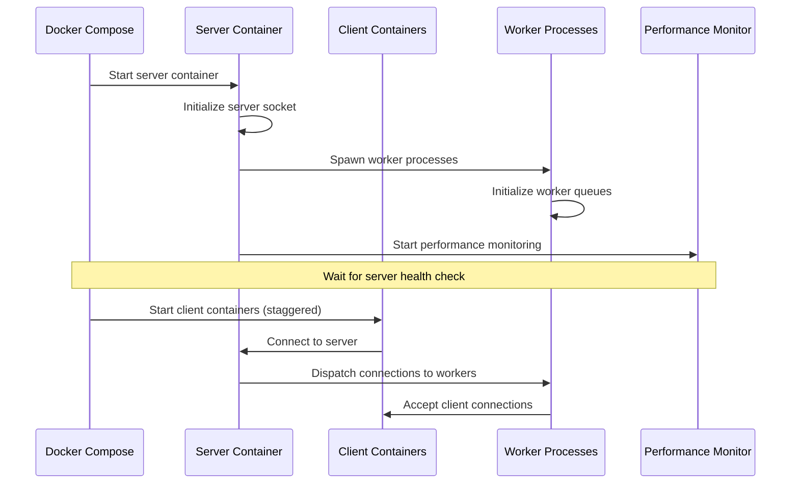
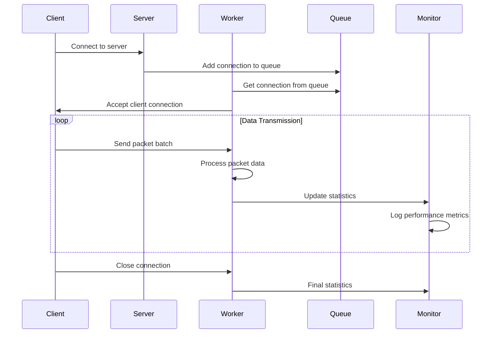

# Multiprocessing Server System - Technical Architecture

## Table of Contents
1. [System Overview](#system-overview)
2. [Architecture Components](#architecture-components)
3. [Data Flow](#data-flow)
4. [Docker Orchestration](#docker-orchestration)
5. [Multiprocessing Server Implementation](#multiprocessing-server-implementation)
6. [Client Implementation](#client-implementation)
7. [Performance Optimizations](#performance-optimizations)
8. [Integration Guidelines](#integration-guidelines)
9. [Production Considerations](#production-considerations)
10. [Troubleshooting](#troubleshooting)

## System Overview

This system demonstrates a high-performance multiprocessing server architecture designed to handle multiple concurrent clients with high-frequency data transmission (10kHz, 32-byte packets). The system uses Python multiprocessing, Docker containerization, and optimized networking to achieve scalable performance.

### Key Characteristics
- **Target Performance**: 10kHz data rate per client
- **Packet Size**: 32 bytes
- **Concurrent Clients**: Up to 10 clients
- **Architecture**: Master-worker multiprocessing pattern
- **Containerization**: Docker with optimized resource allocation
- **Monitoring**: Real-time performance metrics and analysis

## Architecture Components

### 1. Core Components

```
┌─────────────────────────────────────────────────────────────┐
│                    SYSTEM ARCHITECTURE                      │
├─────────────────────────────────────────────────────────────┤
│                                                             │
│  ┌─────────────────┐    ┌─────────────────────────────────┐  │
│  │   Docker Host   │    │        Application Layer       │  │
│  │                 │    │                                 │  │
│  │ ┌─────────────┐ │    │ ┌─────────────────────────────┐ │  │
│  │ │   Server    │ │    │ │     Multiprocessing        │ │  │
│  │ │ Container   │ │◄───┤ │        Server              │ │  │
│  │ │             │ │    │ │   (Master Process)         │ │  │
│  │ └─────────────┘ │    │ └─────────────────────────────┘ │  │
│  │                 │    │                                 │  │
│  │ ┌─────────────┐ │    │ ┌─────────────────────────────┐ │  │
│  │ │  Client-1   │ │    │ │      Worker Process 1        │ │  │
│  │ │ Container   │ │◄───┤ │                             │ │  │
│  │ └─────────────┘ │    │ └─────────────────────────────┘ │  │
│  │                 │    │                                 │  │
│  │ ┌─────────────┐ │    │ ┌─────────────────────────────┐ │  │
│  │ │  Client-2   │ │    │ │      Worker Process 2        │ │  │
│  │ │ Container   │ │◄───┤ │                             │ │  │
│  │ └─────────────┘ │    │ └─────────────────────────────┘ │  │
│  │                 │    │                                 │  │
│  │ ┌─────────────┐ │    │ ┌─────────────────────────────┐ │  │
│  │ │  Client-N   │ │    │ │      Worker Process N        │ │  │
│  │ │ Container   │ │◄───┤ │                             │ │  │
│  │ └─────────────┘ │    │ └─────────────────────────────┘ │  │
│  └─────────────────┘    └─────────────────────────────────┘  │
│                                                             │
└─────────────────────────────────────────────────────────────┘
```

### 2. Component Responsibilities

| Component | Responsibility |
|-----------|----------------|
| **Docker Compose** | Orchestration, resource management, networking |
| **Server Container** | Main process, connection handling, worker management |
| **Client Containers** | Data generation, transmission, performance monitoring |
| **Worker Processes** | Data processing, client communication |
| **Performance Monitor** | System metrics, resource tracking |

## Data Flow

### 1. System Initialization Flow



### 2. Runtime Data Flow



### 3. Packet Processing Flow

```
Client Packet Generation:
┌─────────────┐    ┌──────────────┐    ┌─────────────┐
│   Timer    │───▶│   Batch     │───▶│   Socket    │
│  (10kHz)   │    │  Assembly   │    │   Send      │
└─────────────┘    └──────────────┘    └─────────────┘
       │                   │                   │
       ▼                   ▼                   ▼
┌─────────────┐    ┌──────────────┐    ┌─────────────┐
│  Rate      │    │  32-byte    │    │  Network    │
│ Control    │    │  Packets    │    │  Buffer     │
└─────────────┘    └──────────────┘    └─────────────┘

Server Packet Processing:
┌─────────────┐    ┌──────────────┐    ┌─────────────┐
│   Socket   │───▶│   Worker     │───▶│ Statistics  │
│   Receive  │    │  Process    │    │  Update     │
└─────────────┘    └──────────────┘    └─────────────┘
       │                   │                   │
       ▼                   ▼                   ▼
┌─────────────┐    ┌──────────────┐    ┌─────────────┐
│  Network   │    │   Data      │    │  Monitor    │
│  Buffer    │    │  Processing │    │  Logging    │
└─────────────┘    └──────────────┘    └─────────────┘
```

## Docker Orchestration

### 1. Docker Compose Configuration

The system uses Docker Compose for orchestration with the following key features:

#### Server Configuration
```yaml
server:
  build: .
  command: python server.py --host 0.0.0.0 --port 8888 --workers 4 --max-clients 10
  ports:
    - "8888:8888"
  deploy:
    resources:
      limits:
        cpus: '6.0'
        memory: 4G
      reservations:
        cpus: '3.0'
        memory: 2G
  healthcheck:
    test: ["CMD", "python", "-c", "import socket; s=socket.socket(); s.connect(('localhost', 8888)); s.close()"]
    interval: 5s
    timeout: 3s
    retries: 3
    start_period: 10s
```

#### Client Configuration
```yaml
client-1:
  build: .
  command: python client_simulator.py --host server --port 8888 --clients 1 --rate 6000 --duration 30
  depends_on:
    server:
      condition: service_healthy
  deploy:
    resources:
      limits:
        cpus: '2.0'
        memory: 1.5G
      reservations:
        cpus: '1.5'
        memory: 1G
  environment:
    - CLIENT_STARTUP_DELAY=0
```

### 2. Build Process

```bash
# 1. Docker builds the image
docker build -t multiprocess_test .

# 2. Docker Compose starts services
docker-compose up -d

# 3. Health checks ensure server readiness
# 4. Clients start with staggered delays
# 5. Connections are established
# 6. Data transmission begins
```

### 3. Network Architecture

```
┌─────────────────────────────────────────────────────────────┐
│                    Docker Network                          │
│                   (optimized_network)                       │
├─────────────────────────────────────────────────────────────┤
│                                                             │
│  ┌─────────────┐    ┌─────────────┐    ┌─────────────┐     │
│  │   Server    │    │  Client-1   │    │  Client-2   │     │
│  │ 172.20.0.2  │◄───┤ 172.20.0.3  │    │ 172.20.0.4  │     │
│  │   :8888     │    │             │    │             │     │
│  └─────────────┘    └─────────────┘    └─────────────┘     │
│                                                             │
│  ┌─────────────┐    ┌─────────────┐    ┌─────────────┐     │
│  │  Client-3   │    │  Client-4   │    │  Client-5   │     │
│  │ 172.20.0.5  │    │ 172.20.0.6  │    │ 172.20.0.7  │     │
│  └─────────────┘    └─────────────┘    └─────────────┘     │
│                                                             │
└─────────────────────────────────────────────────────────────┘
```

## Multiprocessing Server Implementation

### 1. Architecture Pattern: Master-Worker

The server implements a **Master-Worker** multiprocessing pattern:

```python
class MultiprocessingServer:
    def __init__(self, host, port, num_workers=4, max_clients=10):
        self.host = host
        self.port = port
        self.num_workers = num_workers
        self.max_clients = max_clients
        
        # Inter-process communication
        self.connection_queue = multiprocessing.Queue()
        self.stats_queue = multiprocessing.Queue()
        
        # Worker processes
        self.workers = []
        self.running = False
```

### 2. Process Management

#### Master Process Responsibilities
1. **Socket Management**: Accept incoming connections
2. **Load Balancing**: Distribute connections to workers
3. **Process Monitoring**: Monitor worker health
4. **Statistics Aggregation**: Collect and report metrics
5. **Resource Management**: Handle process lifecycle

#### Worker Process Responsibilities
1. **Connection Handling**: Manage client connections
2. **Data Processing**: Process incoming packets
3. **Statistics Collection**: Track performance metrics
4. **Error Handling**: Manage connection errors

### 3. Inter-Process Communication

```python
# Connection Distribution
def start(self):
    # Start worker processes
    for i in range(self.num_workers):
        worker = multiprocessing.Process(
            target=worker_process,
            args=(i, self.connection_queue, self.stats_queue)
        )
        worker.start()
        self.workers.append(worker)
    
    # Main accept loop
    while self.running:
        try:
            client_socket, client_address = self.server_socket.accept()
            # Distribute to worker via queue
            self.connection_queue.put((client_socket, client_address))
        except BlockingIOError:
            time.sleep(0.001)  # Non-blocking accept
```

### 4. Worker Process Implementation

```python
def worker_process(worker_id, connection_queue, stats_queue):
    """Worker process for handling client connections"""
    
    # Set process priority for better performance
    try:
        current_process = psutil.Process()
        current_process.nice(psutil.HIGH_PRIORITY_CLASS)
    except Exception as e:
        print(f"Worker {worker_id}: Could not set process priority: {e}")
    
    # Process connections from queue
    while True:
        try:
            # Get connection from queue
            client_socket, client_address = connection_queue.get(timeout=1)
            
            # Handle client connection
            handle_client(client_socket, client_address, worker_id, stats_queue)
            
        except queue.Empty:
            continue
        except Exception as e:
            logger.error(f"Worker {worker_id} error: {e}")
```

### 5. Connection Handling

```python
def handle_client(client_socket, client_address, worker_id, stats_queue):
    """Handle individual client connection"""
    
    # Optimize client socket
    client_socket.setsockopt(socket.IPPROTO_TCP, socket.TCP_NODELAY, 1)
    client_socket.setsockopt(socket.SOL_SOCKET, socket.SO_KEEPALIVE, 1)
    client_socket.setsockopt(socket.SOL_SOCKET, socket.SO_RCVBUF, 131072)
    client_socket.setsockopt(socket.SOL_SOCKET, socket.SO_SNDBUF, 131072)
    
    # Process packets
    while True:
        try:
            data = client_socket.recv(4096)
            if not data:
                break
            
            # Process received data
            process_packets(data, worker_id, stats_queue)
            
        except ConnectionError:
            break
        except Exception as e:
            logger.error(f"Client handling error: {e}")
            break
    
    client_socket.close()
```

## Client Implementation

### 1. High-Performance Client Architecture

```python
class OptimizedClient:
    def __init__(self, client_id, target_rate=10000.0):
        self.client_id = client_id
        self.target_rate = target_rate
        
        # Performance optimizations
        self.packet_data = b'X' * 32  # Pre-allocated packet
        self.batch_size = max(1, int(target_rate / 200))  # Batch packets
        self.send_timeout = 0.001  # 1ms timeout
```

### 2. Data Transmission Strategy

#### Batch Processing
- **Batch Size**: `target_rate / 200` (e.g., 30 packets for 6000 Hz)
- **Transmission Rate**: Controlled by precise timing
- **Error Handling**: Retry logic with exponential backoff

#### Connection Management
```python
def connect(self, host, port):
    """Enhanced connection with retry logic"""
    
    max_retries = 10
    retry_delay = 0.5
    
    for attempt in range(max_retries):
        try:
            self.socket.connect((host, port))
            return True
        except (BlockingIOError, ConnectionRefusedError, OSError) as e:
            if attempt < max_retries - 1:
                time.sleep(retry_delay)
                retry_delay = min(retry_delay * 1.5, 2.0)
            else:
                return False
```

### 3. Rate Control Implementation

```python
def _transmission_loop(self, duration):
    """Precise rate-controlled transmission"""
    
    packet_interval = 1.0 / self.target_rate
    start_time = time.time()
    next_send_time = start_time
    
    while time.time() - start_time < duration:
        current_time = time.time()
        
        if current_time >= next_send_time:
            self._send_batch()
            next_send_time += packet_interval * self.batch_size
        else:
            # Precise timing control
            sleep_time = next_send_time - current_time
            time.sleep(sleep_time)
```

## Performance Optimizations

### 1. Socket Optimizations

```python
# Server socket optimizations
self.server_socket.setsockopt(socket.SOL_SOCKET, socket.SO_REUSEADDR, 1)
self.server_socket.setsockopt(socket.SOL_SOCKET, socket.SO_KEEPALIVE, 1)
self.server_socket.setsockopt(socket.SOL_SOCKET, socket.SO_RCVBUF, 131072)
self.server_socket.setsockopt(socket.SOL_SOCKET, socket.SO_SNDBUF, 131072)
self.server_socket.setblocking(False)

# Client socket optimizations
client_socket.setsockopt(socket.IPPROTO_TCP, socket.TCP_NODELAY, 1)
client_socket.setsockopt(socket.SOL_SOCKET, socket.SO_KEEPALIVE, 1)
client_socket.setsockopt(socket.SOL_SOCKET, socket.SO_RCVBUF, 131072)
client_socket.setsockopt(socket.SOL_SOCKET, socket.SO_SNDBUF, 131072)
```

### 2. Process Optimizations

```python
# Process priority
current_process = psutil.Process()
current_process.nice(psutil.HIGH_PRIORITY_CLASS)

# CPU affinity
os.sched_setaffinity(0, range(multiprocessing.cpu_count()))
```

### 3. Docker Resource Management

```yaml
# Server resources
deploy:
  resources:
    limits:
      cpus: '6.0'
      memory: 4G
    reservations:
      cpus: '3.0'
      memory: 2G

# Client resources
deploy:
  resources:
    limits:
      cpus: '2.0'
      memory: 1.5G
    reservations:
      cpus: '1.5'
      memory: 1G
```

## Integration Guidelines

### 1. Production Deployment

#### Server Integration
```python
# Example integration in production application
class ProductionServer:
    def __init__(self, config):
        self.server = MultiprocessingServer(
            host=config.host,
            port=config.port,
            num_workers=config.workers,
            max_clients=config.max_clients
        )
        
    def start(self):
        # Add production-specific initialization
        self.setup_logging()
        self.setup_monitoring()
        self.setup_health_checks()
        
        # Start the multiprocessing server
        self.server.start()
    
    def setup_logging(self):
        # Configure production logging
        logging.basicConfig(
            level=logging.INFO,
            format='%(asctime)s - %(name)s - %(levelname)s - %(message)s',
            handlers=[
                logging.FileHandler('server.log'),
                logging.StreamHandler()
            ]
        )
```

#### Client Integration
```python
# Example client integration
class ProductionClient:
    def __init__(self, server_config):
        self.client = OptimizedClient(
            client_id=server_config.client_id,
            target_rate=server_config.target_rate
        )
        
    def connect_and_transmit(self, data_source):
        if self.client.connect(server_config.host, server_config.port):
            self.client.start_transmission(
                duration=server_config.duration,
                data_source=data_source
            )
```

### 2. Scalability Considerations

#### Horizontal Scaling
- **Load Balancer**: Distribute clients across multiple server instances
- **Database Integration**: Store metrics in time-series database
- **Message Queues**: Use Redis/RabbitMQ for inter-process communication

#### Vertical Scaling
- **CPU Cores**: Increase worker processes based on available cores
- **Memory**: Adjust batch sizes based on available RAM
- **Network**: Optimize buffer sizes for network capacity

### 3. Monitoring Integration

```python
# Production monitoring integration
class ProductionMonitor:
    def __init__(self):
        self.metrics_collector = MetricsCollector()
        self.alert_manager = AlertManager()
        
    def collect_metrics(self, server_stats):
        # Collect and forward metrics
        self.metrics_collector.record(
            'packets_processed', server_stats.total_packets
        )
        self.metrics_collector.record(
            'active_connections', server_stats.active_connections
        )
        
        # Check for alerts
        if server_stats.error_rate > 0.1:
            self.alert_manager.send_alert("High error rate detected")
```

## Production Considerations

### 1. Security

#### Network Security
```python
# TLS/SSL integration
import ssl

def create_secure_server():
    context = ssl.create_default_context(ssl.Purpose.CLIENT_AUTH)
    context.load_cert_chain('server.crt', 'server.key')
    
    server_socket = socket.socket(socket.AF_INET, socket.SOCK_STREAM)
    secure_socket = context.wrap_socket(server_socket, server_side=True)
    return secure_socket
```

#### Authentication
```python
# Client authentication
def authenticate_client(client_socket):
    # Implement authentication logic
    auth_token = client_socket.recv(1024)
    if validate_token(auth_token):
        return True
    return False
```

### 2. Error Handling

#### Graceful Shutdown
```python
def graceful_shutdown(signum, frame):
    """Handle graceful shutdown"""
    logger.info("Received shutdown signal")
    
    # Stop accepting new connections
    server.running = False
    
    # Wait for workers to finish
    for worker in workers:
        worker.join(timeout=5)
    
    # Close server socket
    server_socket.close()
```

#### Connection Recovery
```python
def handle_connection_error(client_socket, error):
    """Handle connection errors gracefully"""
    logger.error(f"Connection error: {error}")
    
    try:
        client_socket.close()
    except:
        pass
    
    # Update statistics
    stats_queue.put({
        'type': 'connection_error',
        'timestamp': time.time(),
        'error': str(error)
    })
```

### 3. Performance Tuning

#### System-Level Optimizations
```bash
# Increase file descriptor limits
ulimit -n 65536

# Optimize network parameters
echo 'net.core.rmem_max = 134217728' >> /etc/sysctl.conf
echo 'net.core.wmem_max = 134217728' >> /etc/sysctl.conf
sysctl -p
```

#### Application-Level Tuning
```python
# Tune batch sizes based on system capacity
def calculate_optimal_batch_size(target_rate, system_capacity):
    base_batch_size = target_rate / 100
    
    if system_capacity > 0.8:  # High load
        return base_batch_size * 0.5
    elif system_capacity > 0.5:  # Medium load
        return base_batch_size * 0.8
    else:  # Low load
        return base_batch_size
```

## Troubleshooting

### 1. Common Issues

#### Connection Refused
```bash
# Check if server is running
docker ps | grep server

# Check server logs
docker logs multiprocess_test-server-1

# Check network connectivity
docker exec -it multiprocess_test-client-1-1 ping server
```

#### Performance Issues
```bash
# Monitor resource usage
docker stats

# Check system resources
htop
iostat -x 1

# Analyze network performance
netstat -i
```

#### Memory Issues
```bash
# Check memory usage
free -h
docker stats --no-stream

# Monitor memory leaks
valgrind --tool=memcheck python server.py
```

### 2. Debugging Tools

#### Server Debugging
```python
# Enable debug logging
logging.basicConfig(level=logging.DEBUG)

# Add debug prints
def debug_worker_process(worker_id, connection_queue, stats_queue):
    while True:
        try:
            client_socket, client_address = connection_queue.get(timeout=1)
            print(f"Worker {worker_id} handling {client_address}")
            # ... rest of the code
```

#### Client Debugging
```python
# Add connection debugging
def debug_connect(self, host, port):
    print(f"Attempting to connect to {host}:{port}")
    # ... connection logic
    print(f"Connection successful: {self.socket}")
```

### 3. Performance Analysis

#### Metrics Collection
```python
# Collect detailed metrics
class DetailedMonitor:
    def __init__(self):
        self.metrics = {
            'packet_rates': [],
            'error_rates': [],
            'connection_times': [],
            'memory_usage': []
        }
    
    def record_metric(self, metric_type, value):
        self.metrics[metric_type].append({
            'timestamp': time.time(),
            'value': value
        })
```

#### Profiling
```python
# Profile server performance
import cProfile

def profile_server():
    profiler = cProfile.Profile()
    profiler.enable()
    
    # Run server
    server.start()
    
    profiler.disable()
    profiler.dump_stats('server_profile.prof')
```

## Conclusion

This multiprocessing server system provides a robust foundation for high-performance, concurrent data processing applications. The architecture scales well with proper resource allocation and can be adapted for various production scenarios.

Key takeaways:
- **Scalability**: Master-worker pattern allows horizontal scaling
- **Performance**: Optimized networking and process management
- **Reliability**: Error handling and connection recovery
- **Monitoring**: Comprehensive metrics and debugging tools
- **Production Ready**: Security, authentication, and deployment considerations

For production deployment, consider:
- Load balancing across multiple server instances
- Database integration for persistent metrics
- Security hardening and authentication
- Automated monitoring and alerting
- Container orchestration with Kubernetes or Docker Swarm
